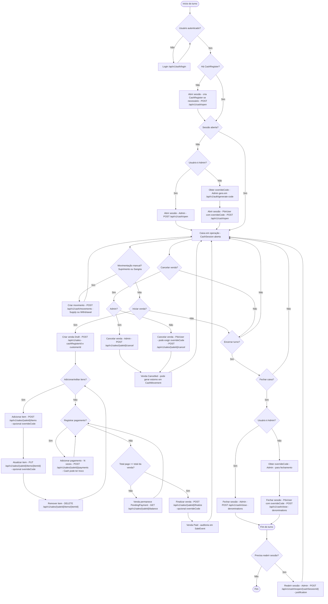

# Fluxo completo do Caixa e Vendas

Este documento descreve o fluxo operacional completo do PDV, desde a abertura do caixa até o fechamento, incluindo movimentações manuais (suprimento/sangria), vendas com pagamento misto e cancelamento com estorno.

## Fluxograma (Mermaid)

## Observações importantes

- A venda sempre nasce vinculada a um `CashRegister` e a uma `CashSession` aberta.
- O fechamento do caixa exige contagem por denominações (`denominations`).
- Cancelamentos podem gerar estorno automático em `CashMovement` quando houver entrada em dinheiro na venda.
